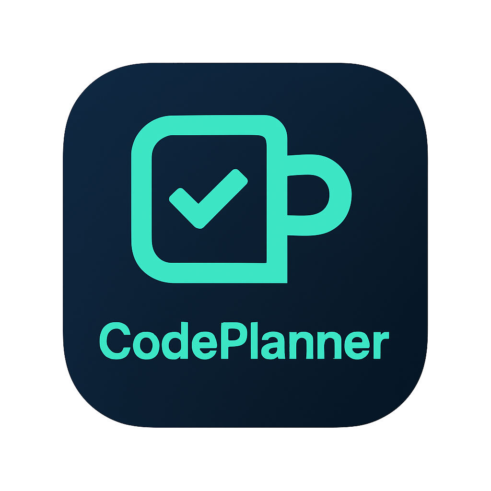

# CodePlanner

<div align="center">
  
  
  **AI 기반 프로젝트 관리 플랫폼**
  
  [](https://nextjs.org/)
  [](https://reactjs.org/)
  [](https://www.typescriptlang.org/)
  [](https://tailwindcss.com/)
</div>

## 📋 목차

- [소개](#-소개)
- [주요 기능](#-주요-기능)
- [기술 스택](#-기술-스택)
- [프로젝트 구조](#-프로젝트-구조)
- [시작하기](#-시작하기)
- [환경 설정](#-환경-설정)
- [개발 가이드](#-개발-가이드)
- [배포](#-배포)
- [기여하기](#-기여하기)

## 🚀 소개

CodePlanner는 AI 기술을 활용한 현대적인 프로젝트 관리 플랫폼입니다. 개발팀의 협업을 효율적으로 지원하며, GitHub 연동, 칸반 보드, AI 기반 이슈 생성 등 다양한 기능을 제공합니다.

### 핵심 특징

- 🤖 **AI 기반 이슈 생성**: 회의록을 바탕으로 자동으로 이슈를 생성
- 📊 **실시간 프로젝트 대시보드**: 진행 상황과 통계를 한눈에 확인
- 🎯 **칸반 보드**: 드래그 앤 드롭으로 직관적인 작업 관리
- 🔗 **GitHub 연동**: 저장소와 브랜치 자동 생성
- 👥 **팀 협업**: 멤버 관리 및 권한 설정
- 📈 **타임라인 관리**: 간트 차트를 통한 일정 관리

## ✨ 주요 기능

### 1. AI 이슈 생성기
- 회의록 텍스트를 분석하여 자동으로 이슈 생성
- 이슈 타입과 우선순위 자동 분류
- GitHub 브랜치 자동 생성

### 2. 프로젝트 대시보드
- 실시간 진행 상황 모니터링
- 멤버별 기여도 분석
- 이슈 타입별 통계 차트
- 최근 활동 내역

### 3. 칸반 보드
- 드래그 앤 드롭으로 이슈 이동
- 컬럼별 작업 상태 관리
- 실시간 업데이트

### 4. GitHub 연동
- 저장소 연결 및 동기화
- 브랜치 자동 생성
- Pull Request 관리

## 🛠 기술 스택

### Frontend
- **Next.js 15.2.4** - React 기반 풀스택 프레임워크
- **React 18** - 사용자 인터페이스 라이브러리
- **TypeScript 5.8.3** - 정적 타입 검사
- **Tailwind CSS 3.4.17** - 유틸리티 우선 CSS 프레임워크

### UI/UX
- **Radix UI** - 접근성 중심 컴포넌트
- **Lucide React** - 아이콘 라이브러리
- **Nivo** - 데이터 시각화 차트
- **React Beautiful DnD** - 드래그 앤 드롭

### 개발 도구
- **ESLint** - 코드 품질 관리
- **PostCSS** - CSS 전처리기
- **Autoprefixer** - CSS 벤더 프리픽스

## 📁 프로젝트 구조

```
📦 CodePlanner_Frontend
 ┣ 📂 app                        # Next.js App Router
 ┃ ┣ 📂 api                      # API 라우트
 ┃ ┣ 📂 auth                     # 인증 관련 페이지
 ┃ ┃ ┣ 📂 login                  # 로그인
 ┃ ┃ ┣ 📂 github-oauth           # GitHub OAuth
 ┃ ┃ ┣ 📂 forgot-password        # 비밀번호 찾기
 ┃ ┃ ┗ 📂 reset-password         # 비밀번호 재설정
 ┃ ┣ 📂 projects                 # 프로젝트 관련 페이지
 ┃ ┃ ┗ 📂 [projectId]            # 동적 프로젝트 라우트
 ┃ ┃   ┣ 📂 board                # 칸반 보드
 ┃ ┃   ┣ 📂 summary              # 프로젝트 대시보드
 ┃ ┃   ┣ 📂 issue-generater-ai   # AI 이슈 생성
 ┃ ┃   ┣ 📂 timeline             # 타임라인/간트차트
 ┃ ┃   ┣ 📂 settings             # 프로젝트 설정
 ┃ ┃   ┗ 📂 list                 # 이슈 리스트
 ┃ ┣ 📂 user                     # 사용자 관련 페이지
 ┃ ┗ 📂 welcome                  # 웰컴 페이지
 ┣ 📂 components                 # 공통 컴포넌트
 ┃ ┣ 📂 ui                       # UI 컴포넌트
 ┃ ┣ 📂 icons                    # 아이콘 컴포넌트
 ┃ ┗ 📂 theme-provider           # 테마 관리
 ┣ 📂 lib                        # 유틸리티 및 API
 ┣ 📂 public                     # 정적 파일
 ┗ 📂 scripts                    # 배포 스크립트
```

## 🚀 시작하기

### 필수 요구사항

- Node.js 18.0.0 이상
- npm 또는 pnpm
- Git

### 설치 및 실행

1. **저장소 클론**
   ```bash
   git clone <repository-url>
   cd Codeplanner_Frontend
   ```

2. **의존성 설치**
   ```bash
   npm install
   # 또는
   pnpm install
   ```

3. **환경 변수 설정**
   ```bash
   cp .env.example .env.local
   ```

4. **개발 서버 실행**
   ```bash
   npm run dev
   # 또는
   pnpm dev
   ```

5. **브라우저에서 확인**
   ```
   http://localhost:3000
   ```

## ⚙️ 환경 설정

### 환경 변수

`.env.local` 파일에 다음 환경 변수를 설정하세요:

```bash
# API 설정
NEXT_PUBLIC_API_URL=http://localhost:5000
NEXT_PUBLIC_ENV=development

# GitHub OAuth (선택사항)
GITHUB_CLIENT_ID=your_github_client_id
GITHUB_CLIENT_SECRET=your_github_client_secret

# 기타 설정
NEXTAUTH_SECRET=your_nextauth_secret
NEXTAUTH_URL=http://localhost:3000
```

### 개발 스크립트

```bash
# 개발 서버 실행
npm run dev

# 프로덕션 빌드
npm run build

# 프로덕션 서버 실행
npm run start

# 린트 검사
npm run lint

# 린트 자동 수정
npm run lint:fix

# 타입 체크
npm run type-check
```

## 💻 개발 가이드

### 코드 스타일

- **TypeScript**: 모든 컴포넌트와 함수에 타입 정의
- **ESLint**: 코드 품질 및 일관성 유지
- **Prettier**: 코드 포맷팅

### 컴포넌트 작성 가이드

```typescript
// 컴포넌트 예시
interface ComponentProps {
  title: string;
  children: React.ReactNode;
}

export default function Component({ title, children }: ComponentProps) {
  return (
    <div className="p-4">
      <h1 className="text-2xl font-bold">{title}</h1>
      {children}
    </div>
  );
}
```

### API 호출 패턴

```typescript
// API 호출 예시
import { getApiUrl } from "@/lib/api";

const fetchData = async () => {
  const response = await fetch(`${getApiUrl()}/api/endpoint`, {
    method: "GET",
    credentials: "include",
  });
  
  if (!response.ok) {
    throw new Error("API 호출 실패");
  }
  
  return response.json();
};
```

## 🚀 배포

### 프로덕션 빌드

```bash
# 프로덕션 빌드
npm run build:prod

# 프로덕션 서버 실행
npm run start:prod
```

### Docker 배포 (선택사항)

```dockerfile
FROM node:18-alpine

WORKDIR /app
COPY package*.json ./
RUN npm ci --only=production

COPY . .
RUN npm run build

EXPOSE 3000
CMD ["npm", "start"]
```

### Nginx 설정

프로젝트에 포함된 `nginx.conf` 파일을 참고하여 웹 서버 설정을 구성하세요.

## 🤝 기여하기

1. Fork the Project
2. Create your Feature Branch (`git checkout -b feature/AmazingFeature`)
3. Commit your Changes (`git commit -m 'Add some AmazingFeature'`)
4. Push to the Branch (`git push origin feature/AmazingFeature`)
5. Open a Pull Request

### 기여 가이드라인

- 코드 작성 시 TypeScript 타입을 명시적으로 정의
- 컴포넌트는 재사용 가능하도록 설계
- 새로운 기능 추가 시 테스트 코드 작성
- 커밋 메시지는 명확하고 설명적으로 작성

## 📄 라이선스

이 프로젝트는 MIT 라이선스 하에 배포됩니다. 자세한 내용은 `LICENSE` 파일을 참조하세요.

## 📞 지원

- **이슈 리포트**: [GitHub Issues](https://github.com/your-repo/issues)
- **문서**: [Wiki](https://github.com/your-repo/wiki)
- **이메일**: support@codeplanner.com

## 🙏 감사의 말

- [Next.js](https://nextjs.org/) - 훌륭한 React 프레임워크
- [Tailwind CSS](https://tailwindcss.com/) - 유틸리티 우선 CSS
- [Radix UI](https://www.radix-ui.com/) - 접근성 중심 컴포넌트
- [Nivo](https://nivo.rocks/) - 데이터 시각화 라이브러리

---

<div align="center">
  <p>Made with ❤️ by the CodePlanner Team</p>
  <p>⭐ Star this repository if you found it helpful!</p>
</div>
